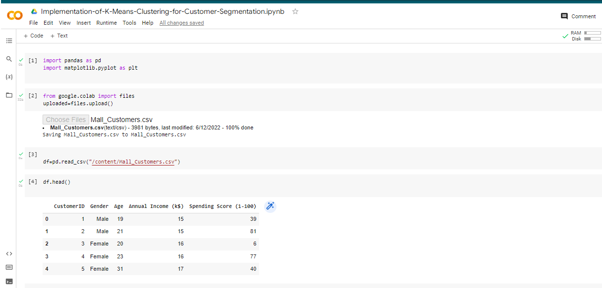
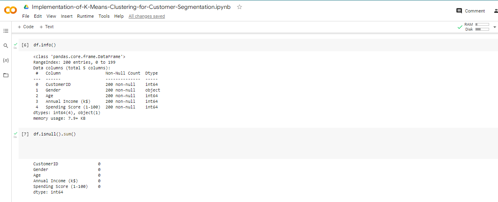
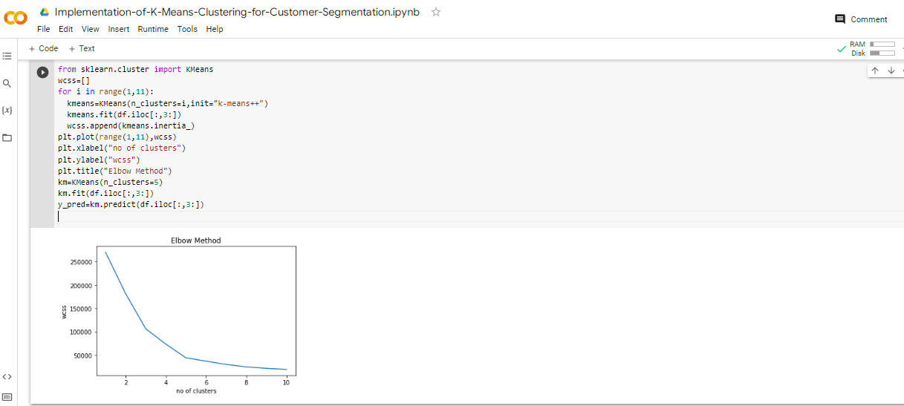
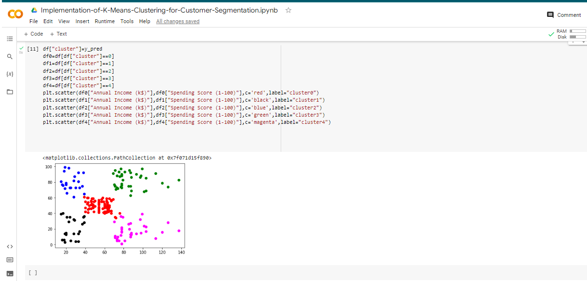

# Implementation-of-K-Means-Clustering-for-Customer-Segmentation

## AIM:
To write a program to implement the K Means Clustering for Customer Segmentation.

## Equipments Required:
1. Hardware – PCs
2. Anaconda – Python 3.7 Installation / Moodle-Code Runner

## Algorithm
1. Import pandas as pd .

2. Import matplotlib.plt.

3. From sklearn import kmeans cluster. 

4. Append kmeans,itertia.

5. Plot xlabel,ylabel.

6. Title as Elbow method.

7. Predict the y.

8. plot scatters for df0,1,2,3,4.

9. Give different colors.

10. Run the programme. 

## Program:
```

Program to implement the K Means Clustering for Customer Segmentation.
Developed by: Silamabarasan K
RegisterNumber:  212221230101

import pandas as pd
import matplotlib.pyplot as plt
df=pd.read_csv("/content/Mall_Customers.csv")
df.head()
df.info()
df.isnull().sum()
from sklearn.cluster import KMeans
wcss=[]
for i in range(1,11):
  kmeans=KMeans(n_clusters=i,init="k-means++")
  kmeans.fit(df.iloc[:,3:])
  wcss.append(kmeans.inertia_)
plt.plot(range(1,11),wcss)
plt.xlabel("no of clusters")
plt.ylabel("wcss")
plt.title("Elbow Method")
km=KMeans(n_clusters=5)
km.fit(df.iloc[:,3:])
y_pred=km.predict(df.iloc[:,3:])
df["cluster"]=y_pred
df0=df[df["cluster"]==0]
df1=df[df["cluster"]==1]
df2=df[df["cluster"]==2]
df3=df[df["cluster"]==3]
df4=df[df["cluster"]==4]
plt.scatter(df0["Annual Income (k$)"],df0["Spending Score (1-100)"],c='red',label="cluster0")
plt.scatter(df1["Annual Income (k$)"],df1["Spending Score (1-100)"],c='black',label="cluster1")
plt.scatter(df2["Annual Income (k$)"],df2["Spending Score (1-100)"],c='blue',label="cluster2")
plt.scatter(df3["Annual Income (k$)"],df3["Spending Score (1-100)"],c='green',label="cluster3")
plt.scatter(df4["Annual Income (k$)"],df4["Spending Score (1-100)"],c='magenta',label="cluster4")
```

## Output:






## Result:
Thus the program to implement the K Means Clustering for Customer Segmentation is written and verified using python programming.
